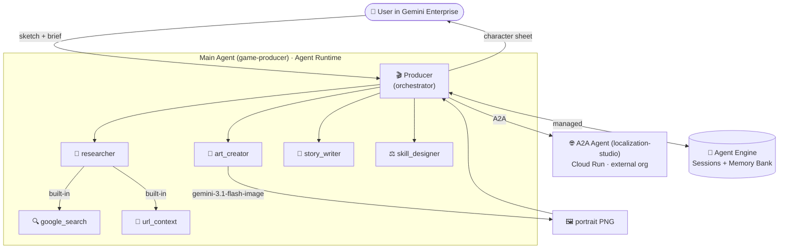

# 🎮 Game Character Designer — Gemini Enterprise Agent Platform demo

An end-to-end **multi-agent demo** for the **Gemini Enterprise Agent Platform**, built
with [Antigravity (`agy`)](https://antigravity.google) and `agents-cli` on Google Cloud.

Upload a character sketch (or a short brief) → a team of agents produces a finished game
character — refined portrait, lore, balanced stats, and 3-language localization — shown
inside Gemini Enterprise.

## 📚 Interactive codelab

The full build guide is best read as an interactive, step-by-step **Google Codelab**,
hosted on **GitHub Pages**:

> 👉 **[Open the interactive codelab](https://hxhwing.github.io/agent-platform-demo/)**

The codelab is rebuilt from [`guide.md`](guide.md) and published automatically by
[`.github/workflows/codelab-pages.yml`](.github/workflows/codelab-pages.yml) on every push.

**One-time setup:** in your repo go to **Settings → Pages → Build and deployment →
Source** and select **GitHub Actions**. The next push to `main` (or a manual run from the
**Actions** tab) publishes the site.

Other ways to view it:
- **Read it as Markdown:** [`guide.md`](guide.md) (renders fine on GitHub)
- **Preview locally:** `cd codelab && ./build.sh && ./serve.sh` → `http://localhost:8080`

> ⚠️ The codelab HTML does **not** render in the GitHub file browser (GitHub shows raw
> source for `.html`) — use the Pages link above.

See [`codelab/README.md`](codelab/README.md) for how the codelab is generated.

---

## Architecture



One user request fans out across **5 specialist agents** + **1 external A2A org**,
generates an image, persists **per-user memory**, and streams the result back inside
Gemini Enterprise — exercising Agent Runtime, managed Sessions + Memory Bank, A2A, Model
Armor, and Cloud Trace.

## Repo layout

| Path | What it is |
|---|---|
| [`game-producer/`](game-producer/) | **Main Agent** — orchestrator + 5 specialists. Deploys to **Agent Runtime** (template `adk`). |
| [`localization-studio/`](localization-studio/) | **A2A Agent** — the "external org" reached over **A2A**. Deploys to **Cloud Run** (template `adk_a2a`). |
| [`guide.md`](guide.md) | The complete, self-contained build guide (every step, both `agy` and `agents-cli` paths). |
| [`TODOs-for-coding-agent.md`](TODOs-for-coding-agent.md) | Machine-readable to-do + pitfall checklist for the coding agent. |
| [`codelab/`](codelab/) | Tooling to publish `guide.md` as an interactive Google Codelab (see below). |
| [`run_local.sh`](run_local.sh) | Bring up both agents locally for a quick demo. |

## Quick start

```bash
# 1. Configure each agent (the real .env is gitignored — start from the template)
cp game-producer/.env.example       game-producer/.env
cp localization-studio/.env.example localization-studio/.env
# edit both: set GOOGLE_CLOUD_PROJECT to your own GCP project id

# 2. Run both agents locally (in-memory sessions/memory, no Agent Engine needed)
./run_local.sh
```

For the full deploy-to-cloud walkthrough, follow [`guide.md`](guide.md).

## Requirements

- A Google Cloud project with Vertex AI enabled
- `gcloud` CLI, Python 3.11+, and [`uv`](https://docs.astral.sh/uv/)
- `agents-cli` (Google Agent Development Kit tooling)

> **Note:** Gemini 3 models resolve only in `location=global`; the agents set this in code.
